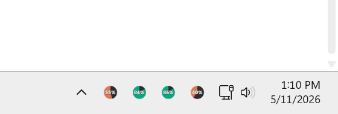
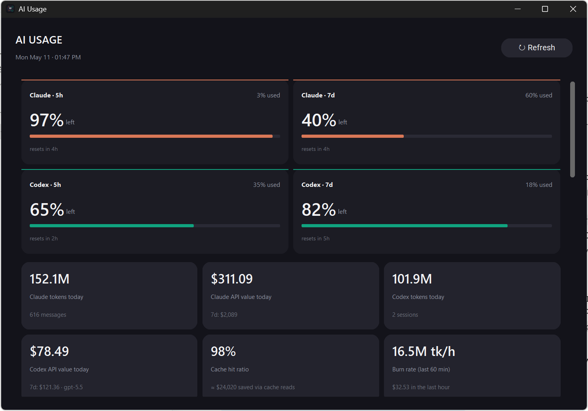
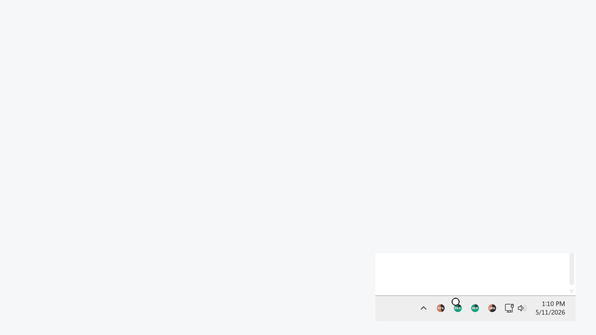

# AI Usage Tray

Windows tray icons for local Claude Code and Codex CLI usage.

The app runs four notification-area icons:

- Claude 5-hour window
- Claude weekly window
- Codex 5-hour window
- Codex weekly window

Each icon shows percentage left. Clicking any icon opens the native stats dashboard with today's totals, model split, top projects/tools, activity heatmap, and recent daily totals.







## Install

Use Python 3.11+ on Windows.

```powershell
git clone https://github.com/LLRHook/usage-widget.git
cd usage-widget
py -3 -m venv .venv
.\.venv\Scripts\python.exe -m pip install -r requirements.txt
.\.venv\Scripts\python.exe .\tray.py --install-startup
```

The installer writes a current-user `Run` registry entry named `AI Usage Tray` and launches the tray immediately. It also removes legacy Startup-folder shortcuts from older builds.

## Run Manually

```powershell
.\.venv\Scripts\pythonw.exe .\tray.py
```

Right-click any tray icon for `Refresh now`, `Open dashboard`, or `Quit`.

## Uninstall

```powershell
.\.venv\Scripts\python.exe .\tray.py --uninstall-startup
```

To remove the old Windows widget package from previous builds, run:

```powershell
Get-AppxPackage -Name AIUsageWidget | Remove-AppxPackage
```

## Data Sources

- Claude data is read from `%USERPROFILE%\.claude\projects`.
- Codex data is read from `%USERPROFILE%\.codex\sessions`.
- Claude plan percentages come from `probe_claude.py`, which uses Claude Code's local OAuth credentials and caches rate-limit headers in `%TEMP%\claude_ratelimits.json`.
- Codex percentages come from the latest local Codex `token_count` rate-limit payloads.

No telemetry is sent by this app except the optional Claude rate-limit probe to Anthropic when `probe_claude.py` refreshes its cache.
